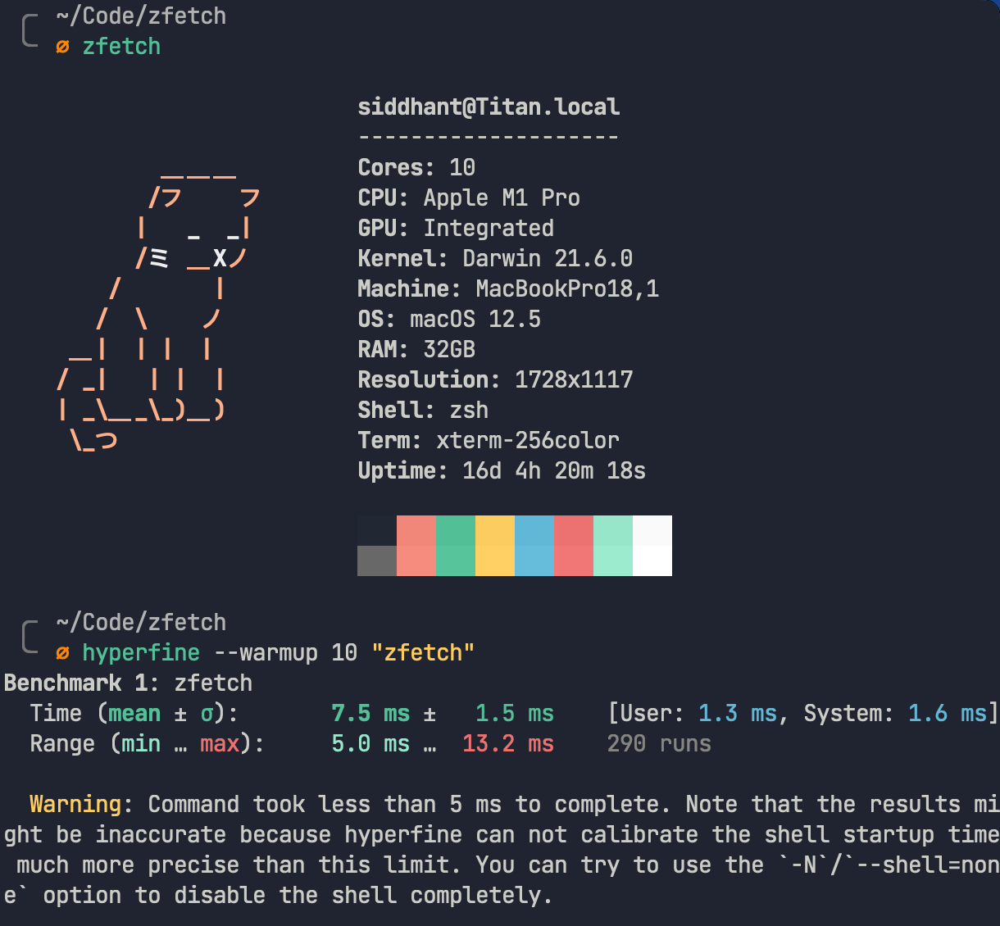
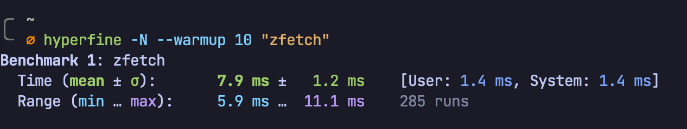

# zfetch

Ultraquick terminal greeter




### Build

You'll need `zig` installed. [Here's how to do that](https://ziglang.org/download/)

Then, build this project:

```sh
zig build -Drelease-fast=true
```

This will create a `zfetch` binary in the `zig-out/bin` directory.
You can now run this binary as part of your shell's startup! The first run is
significantly slower than subsequent runs. You should see sub-10ms timings.

I like to add this `zig-out/bin` directory to my `$PATH` for that clean `zfetch` invocation.

Unfortunately, `zfetch` is only implemented for macOS currently. If you'd like to add
Linux/Windows implementations, PRs are more than welcome!

### Customization

You don't need to know Zig to change small stuff, like the ASCII art.
You'll want to head over to the `src/art.zig` file. Here's where you'll define a
variable for your own ASCII art. You can use terminal escape sequences too! I've
only really tested simple colored output. If you need help with this, I wrote a
small blog post explaining the notation: [Terminal color sequences](https://dietcode.io/p/terminal-colors)

Once you have something you like, change the `active_ascii_art` variable in `art.zig`
to the name of the variable you've stored your ASCII art in.
You'll also want to adjust the `estimated_art_width` variable in `main.zig`. Because
of unicode, it's _really_ hard to do this programmatically, so I opted to just let
people set it manually.

Remember to rebuild your project with:

```sh
zig build -Drelease-fast=true
```

There are two ASCII art strings in here currently: one of Latte (my cat) that I use
on my personal computer, and one of Cloudflare's logo, that I use at work. You should
clone this repo and add one that suits your style! If you're up for it, please
share your art [here](https://github.com/sdnts/zfetch/discussions/2).

### Development

You'll need some Zig knowledge for this obviously. I've opted to write simple,
straight-forward code, I feel like that is in the spirit of the Zig language. No
vtables here! Please start a GitHub Discussion if you need help navigating the code,
I'm more than happy to help.
