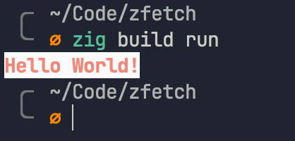

# zig-decor

A super simple utility to help you print pretty strings to the terminal

## Installation

The easiest way to install `decor` is to clone this repository to a `lib` folder in your project, then add a reference to it in your `build.zig` file:

```zig
pub fn build(b: *Builder) void {
  // ..snip
  const exe = b.addExecutable("<your-app>", "src/main.zig");
  // ..snip

  // ..snip
  exe.addPackagePath("decor", "lib/zig-decor/decor.zig");
  // ..snip
}
```

You'll then be able to import it in your project like:

```zig
const Decor = @import("decor").Decor;
```

I haven't figured out Zig package managers yet, contributions are welcome in that regard!

## Usage

The following program outputs `Hello World!` in red, against a white background:

```zig
const std = @import("std");
const Decor = @import("decor").Decor;

pub fn main() !void {
  var stdout = std.io.getStdOut().writer();
  try Decor
    .init()
    .bold()
    .fg(.Red)
    .bg(.White)
    .println(stdout, "Hello {s}!", .{"World"});
}
```



The 8 basic colors have aliases as demonstrated above. If you're looking for more specific colors, you can also provide an [8-bit ANSI color code](https://en.wikipedia.org/wiki/ANSI_escape_code#8-bit):

```zig
const std = @import("std");
const Decor = @import("decor").Decor;

pub fn main() !void {
  var stdout = std.io.getStdOut().writer();
  try Decor
    .init()
    .fgANSI(33)
    .println(stdout, "I'm blue!", .{});
}
```

The general idea is that you configure a `Decor` instance with all styles up front, SwiftUI style, and then call `write`/`print`/`println` to write them to a `Writer` (usually `stdout`). The differences between these three methods are described in the [Reference](#reference) section below.

## Reference

`decor` is tiny on purpose -- I added functionality on a need-basis. The best way to reference functionality is to open up the source file.

```zig
const Style = enum { Bold };
const ColorName = enum(u8) { Black, Red, Green, Blue, Yellow, Magenta, Cyan, White };

const Decor = struct {
    /// Initialize a new instance
    pub fn init() Self

    /// Set the style of your text. Currently supported styles are: .Bold
    pub fn style(self: *Self, s: ?Style) *Self

    /// Set the text style to bold
    pub fn bold(self: *Self) *Self

    /// Set the foreground color of the text to one of the pre-defefined aliases
    pub fn foreground(self: *Self, color: ColorName) *Self

    /// Set the foreground color of the text to one of the pre-defefined aliases
    pub fn fg(self: *Self, color: ColorName) *Self

    /// Set the foreground color of the text to an 8bit ANSI color code
    pub fn foregroundANSI(self: *Self, code: u8) *Self

    /// Set the foreground color of the text to an 8bit ANSI color code
    pub fn fgANSI(self: *Self, code: u8) *Self

    /// Set the background color of the text to one of the pre-defefined aliases
    pub fn background(self: *Self, color: ColorName) *Self

    /// Set the background color of the text to one of the pre-defefined aliases
    pub fn bg(self: *Self, color: ColorName) *Self

    /// Set the background color of the text to an 8bit ANSI color code
    pub fn backgroundANSI(self: *Self, code: u8) *Self

    /// Set the background color of the text to an 8bit ANSI color code
    pub fn bgANSI(self: *Self, code: u8) *Self

    /// Write the configured text to a Writer (usually stdout). Returns the number of bytes written.
    pub fn write(self: *Self, writer: Writer, comptime format: []const u8, args: anytype) !usize

    /// Write the configured text to a Writer (usually stdout). Useful as an alternative to `write` when you do not care about the number of bytes written.
    pub fn print(self: *Self, writer: Writer, comptime format: []const u8, args: anytype) !void

    /// Write the configured text to a Writer (usually stdout), and add a new line. Useful shorthand.
    pub fn println(self: *Self, writer: Writer, comptime format: []const u8, args: anytype) !void
}
```
